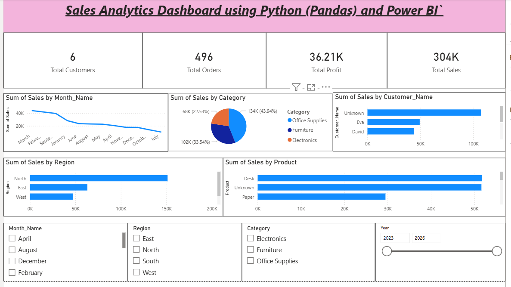

# 📊 Python + Power BI Sales Analytics Dashboard

## 📌 Project Overview

This project demonstrates an **end-to-end Sales Analytics Dashboard** built using **Python (Pandas)** and **Power BI**.

The project focuses on cleaning dirty sales data, performing data preprocessing and feature engineering using Python, and creating an interactive Power BI dashboard to generate business insights.

---

## 🚀 Technologies Used

* Python
* Pandas
* NumPy
* Jupyter Notebook
* Power BI Desktop
* Microsoft Excel

---

## 🛠 Data Cleaning Process

* Handled missing values
* Removed duplicate records
* Converted incorrect data types
* Fixed invalid date values
* Created Year, Month, Month Name, and Quarter columns
* Calculated Sales and Profit metrics
* Created Profit Margin column

---

## 📊 Dashboard Features

* 💰 Total Sales KPI
* 💵 Total Profit KPI
* 📦 Total Orders KPI
* 👥 Total Customers KPI
* 📈 Monthly Sales Trend
* 🌍 Region-wise Sales Analysis
* 📂 Category-wise Sales Analysis
* 🛒 Product-wise Sales
* 🎛 Interactive Filters (Year, Month, Region, Category)

---

## 📁 Project Files

* Cleaning Dataset.ipynb
* Cleaned_Sales_Data.xlsx
* Python_PowerBI_Dirty_Sales_Dataset.xlsx
* Python_PowerBI_Sales_Analytics.pbix

---

## 🎯 Business Insights

This dashboard helps analyze:

* Monthly Sales Performance
* Regional Sales Distribution
* Category Performance
* Customer Sales Analysis
* Product Performance
* Profit Trends

---

## 📷 Dashboard Preview

Upload your dashboard screenshot and add:

```markdown

```

or

```markdown
[](Dashboard.png)
```

to make it clickable.

---

## 👨‍💻 Author

**Shiva Golem**

Aspiring Data Analyst

Python | SQL | Excel | Power BI

---

⭐ If you like this project, give it a Star!
